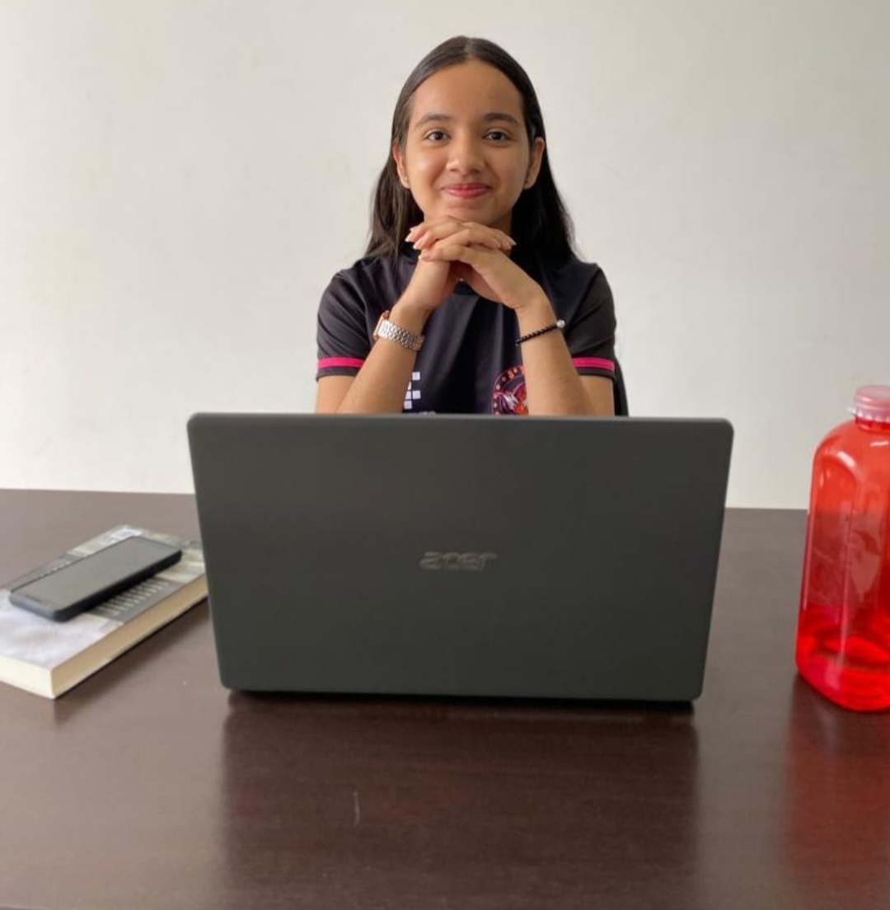
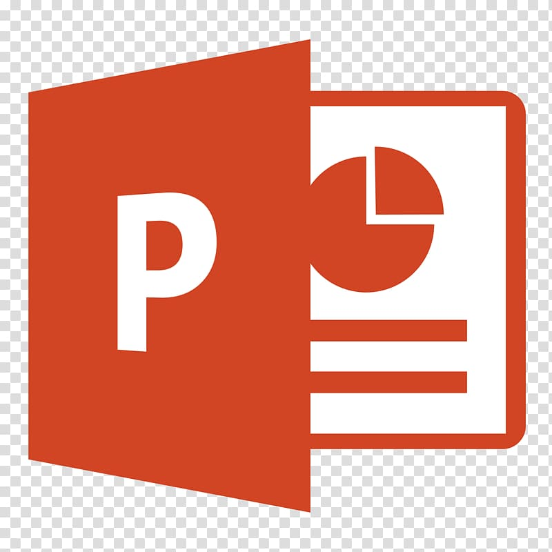
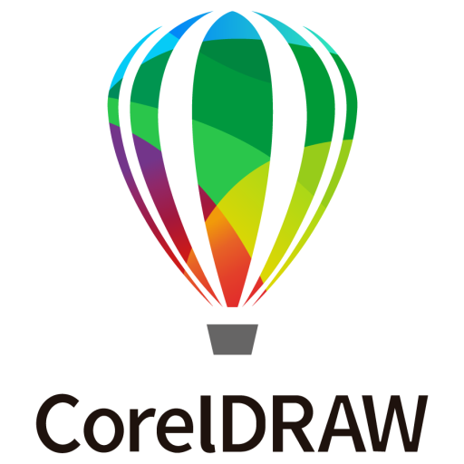
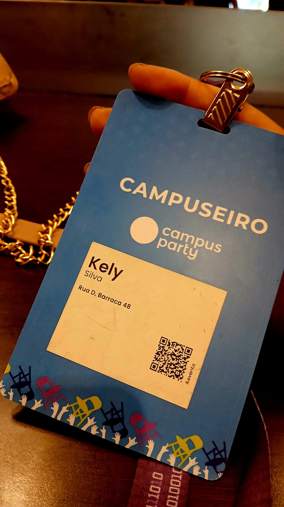
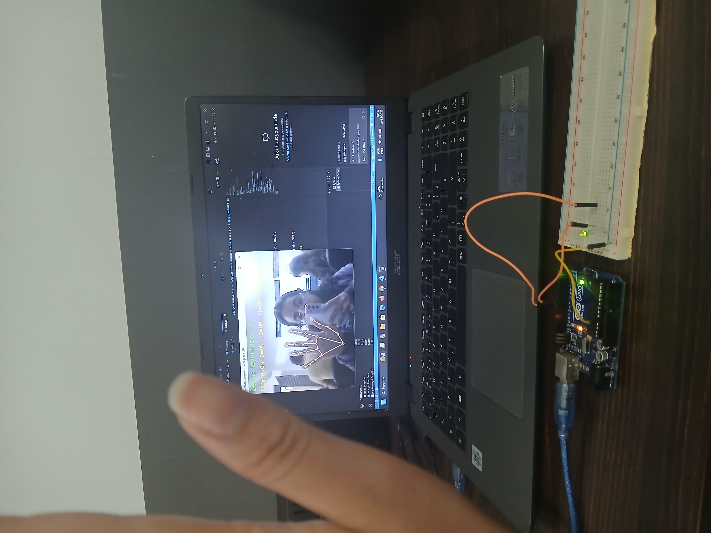
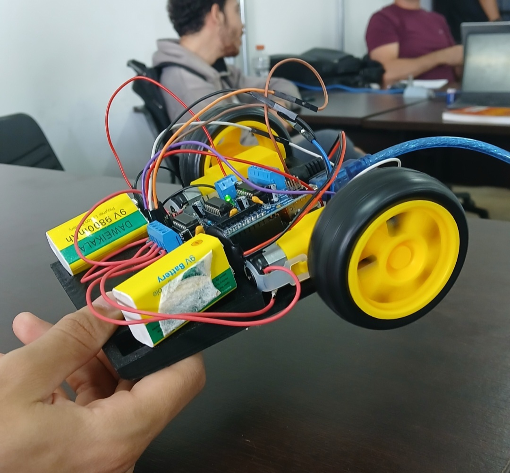

  

<h1 align="center">
  Kely Cristina Pereira da Silva
</h1>

  

---

<h3 style="color:#8A2BE2;">📌 Sobre mim</h3>

- 🎂 20 anos  
- 🖥 Informática Básica + Digitação (2018–2019) | SSMM  
- 💻 Técnica em Informática - IF Goiano  
- 🎓 Estudante do 3º período de Ciência da Computação - IF Goiano  
- 📍 Morrinhos - Goiás  

---

<h3 style="color:#8A2BE2;">🎯 Objetivo</h3>

Construir uma base sólida em tecnologia, desenvolver projetos acadêmicos
e evoluir constantemente como estudante e futura profissional da área,
mantendo organização, disciplina e aprendizado contínuo.

---

<h3 style="color:#8A2BE2;">🧠 Linguagens que já estudei</h3>

---

<h3 style="color:#8A2BE2;">🖥 Arquitetura de Computadores</h3>

MARS — Simulador Assembly (MIPS)

---

<h3 style="color:#8A2BE2;">🛠 Ferramentas usadas no dia a dia</h3>

Visual Studio Code

---

<h3 style="color:#8A2BE2;">📦 Pacote Office</h3>

---

<h3 style="color:#8A2BE2;">🎨 CorelDRAW</h3>

  

Criação de certificados, calendários e materiais gráficos

---

<h3 style="color:#8A2BE2;">📸 Minha jornada na tecnologia</h3>

💻 Programando • 🚀 Eventos de tecnologia • 📚 Estudando e evoluindo

---

✨ Em constante evolução ✨️

